# FRAUD DETECTION: FAKE JOB POSTING
## Fraud Detection to detect Fraudulent Act/Fake Posting on Job Posting Platform.

#

<p align="center"></p>

#

## About the project

### Fraudulent activity is a dishonest, untrue, false representation or providing a false statement, whether it was intentional or not. On daily life, we can see act of fraudulent anywhere, event in only small cases.

### Job Posting nowdays can be found anywhere, including internet. But there's some cases of Job Posting Fraud that can be found. Due to large amount of job post, it was a hard job to find fraud posting manually. By making a Fraud Detection with Machine Learning, we can handle this problem in fast and easy way.
#
### Objective:

Exploring and Analyze data and try to answer some question such as:
- Was the dataset's target (fraudulent vs real) skewed?
- What feature/column show high correlation to fake job posting?

Preprocessing:
- Extracting text data (cleaning, vectorize)

Model Building and Metric:
- What's the highest accuracy we can get?
- What model predict the best?
#
***check full jupyter notebook [here](fake_job_posting.ipynb)***
#


## Folder Structure
```
.
├── img/                                : contain image used
|   └── fraud.png
|   └── src.txt                         : link source for image
└── plot/                               : contain image file of plot 
└── .gitignore
└── README.md
└── fake_job_posting.ipynb              : complete notebook of fraud detection on job posting platform
```

#
## TABLE OF CONTENT
- THE DATASET
- EXPLORATORY DATA ANALYSIS (EDA)
- PREPROCESSING
- MODEL RESULT AND CONCLUSION
#

# THE DATASET

Dataset sourced from kaggle, uploaded by Shivam Bansal: https://www.kaggle.com/shivamb/real-or-fake-fake-jobposting-prediction 

The dataset contain 18 columns and data of 18k job description with only 800 fake job posting.

I divided those feature to categories:
>#numerical features:
numerical_feat = ['salary_range']

>#categorical features:
categorical_feat = ['fraudulent', 'telecommuting', 'has_company_logo', 'has_questions', 'employment_type', 'required_experience', 'required_education','industry', 'function']

>#text features:
text_feat = ['title', 'location', 'department', 'company_profile', 'description' , 'requirements', 'benefits']

#

# EXPLORATORY DATA ANALYSIS (EDA)

## analysis on target ('fraudulent')
Q: is the target's data skewed?

<p align="center">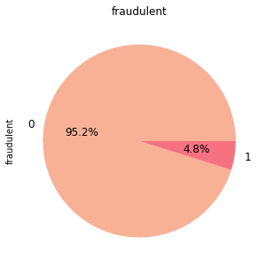</p>

there's only 4,8% fraud on dataset, as expected on fraud where we expect to find small fraud number. Still, we can improve the service and experience by a fraud detection.

however, we need to consider this skewness as it can lead to false negatives, we will do upsampling method to handle this in preprocessing later.

#
## analysis on numerical features
numerical feature consist of:

numerical = ['salary_min', 'salary_max']  (splitted from 'salary_range')

<p align="center">
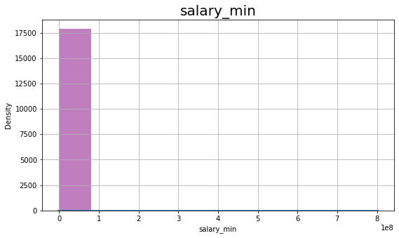
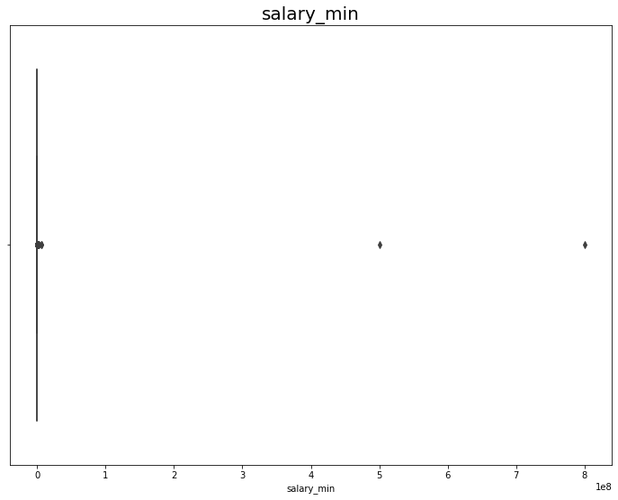
</p>
<p align="center">

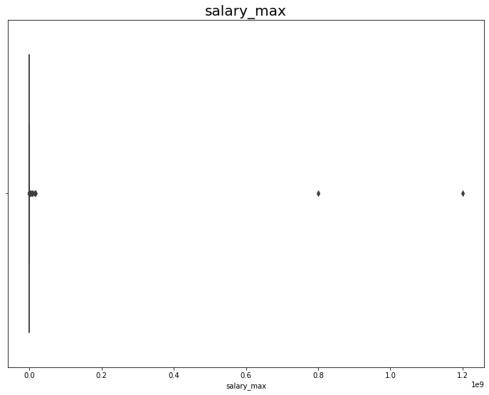
</p>
seems like there's few outlier on 'real' (not fraudulent) data. let's remove it by replacing the value with 0. Since it wasn't fraud case, i think its okay to remove the data.

#
## analysis on categorical features

categorical feature consist of:

categorical_feat = ['telecommuting', 'has_company_logo', 'has_questions', 'employment_type', 'required_experience', 'required_education', 'industry', 'function', 'fraudulent']

#
### - telecommuting

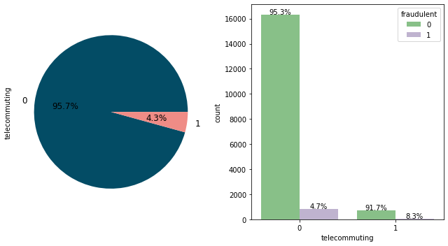</p>

there're more fraud that was not telecommuting, however, the dataset skewed, there're 95,8% of total that was telecommuting.

#
### - has_company_logo

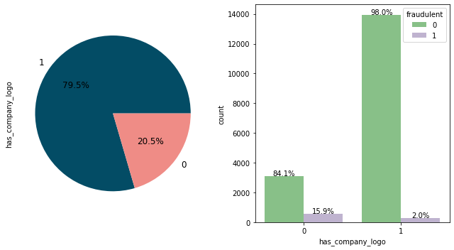</p>

fraud cases more likely to not has_company_logo, with only 2% of data that has_company_logo was a fraud

#
### - has_questions

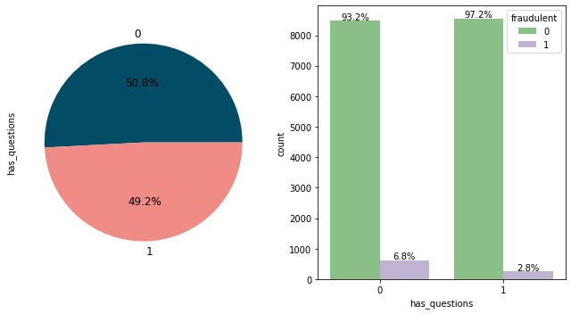</p>

job who listed questions has balance distribution. There're more cases of fraud who didn't has questions.

#
### - employment_type

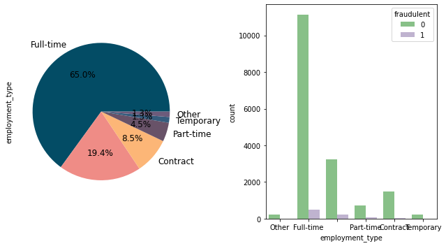</p>

the most common employment type is Full-time with 64,4%, followed with not listing with 19,4% and contract with 8,5%. there's no special pattern for fraudulent cases.

#
### - required_experience

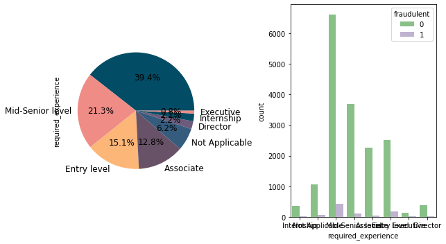</p>

39,4% not listed any required experience. 21% required mid-senior level, 15% entry level, and 12,7% associate. There's no special pattern to fraudulent cases.

#
### - required_education

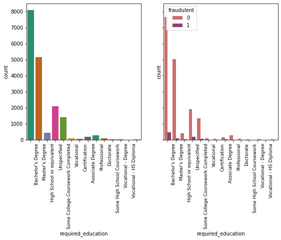</p>

the most common required education is no requirement, followed with bachelor's degree. There's more fraud case happend with no required education listed.

#
### - function

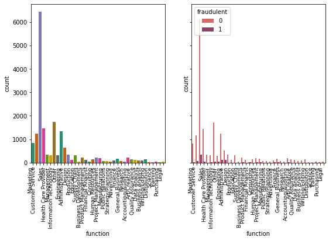</p>

#

### CORRELATION MATRIX

we can see how feature correlated by making correlation matrix heatmap.
<p align="center">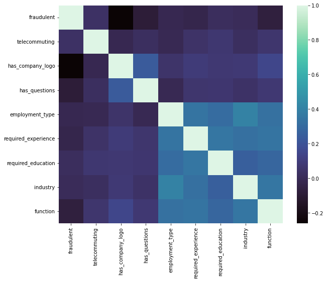</p>

feature correlation to fraudulent:

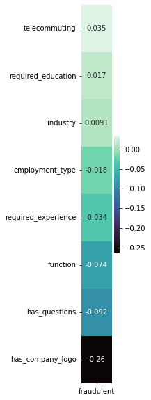</p>

as we expected by analysis before, 'has_company_logo' correlated well with fraudulent

#

## analysis on text feature

text feature consist of:

text_feat = ['title', 'location', 'department', 'company_profile', 'description' , 'requirements', 'benefits']

#
### word count analysis:

<p align="center">
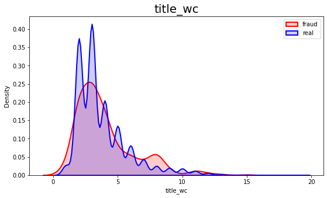
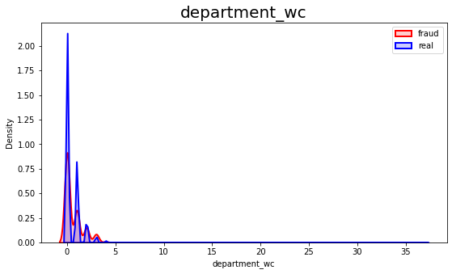
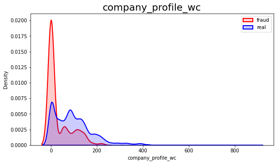
</p>
<p align="center">
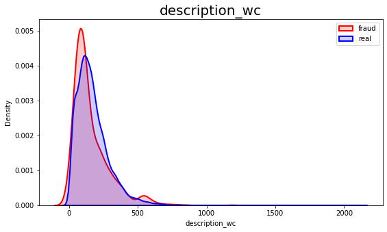
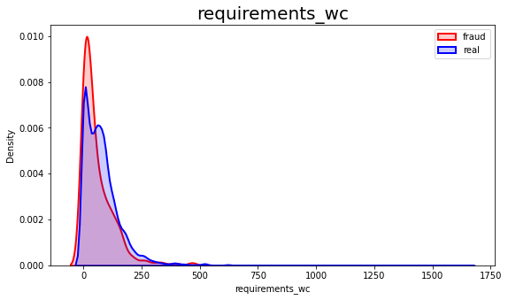
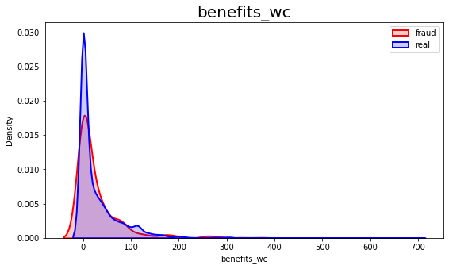
</p>

#
# PREPROCESSING

we will do preprocessing to features:

- categorical features    -> encode
- numerical features      -> scale
- word_count  (numerical) -> scale
- text feature            -> text cleaning and vectorize (TF-IDF)
- target column           -> upsample (reduce skewness)
#
## TEXT PROCESSING
preprocessing/cleaning on text dataset consist of:
1. remove punctuation 
2. tokenize/split
3. remove stopwords
4. lemmatize/stemming
5. remove other (url, html tag, emoji, number)
6. vectorize (TF-IDF)
#
## UPSAMPLING (handling skewness of fraudulent data)
I do upsampling, or generating new data with target of 'fraudulent' I generate about 7000 new data with target 'fraudulent'
#
## SPLIT TRAIN:TEST
Train and Test split with Cross Validation to avoid overfit.

I used StratifiedKFold with K=4, then cross validate.
I then average the accuracy on test prediction to conclude the accuracy of the model. 
#

# MODEL RESULT AND CONCLUSION

I used 4 Machine Learning Algorithm to predict/classified as fraudulent or real:
- Logistic Regression
- Random Forest
- SVM
- XG Boost

Model Accuracy Comparision:

                    model       acc
    1        Random Forest  0.864163
    3             XG Boost  0.853960
    0  Logistic Regression  0.794703
    2                  SVM  0.750604

<br/>
<p align="center">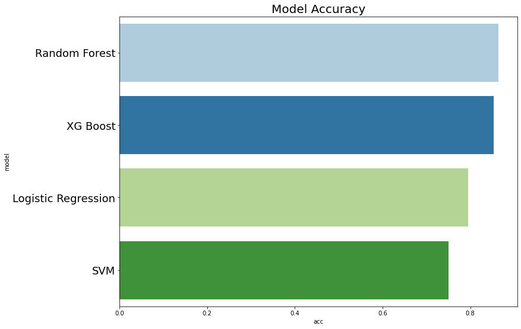</p>

#
## CONCLUSION
we've build simple fraud detection model to detect fraudulent on job posting dataset. [NOTE:] there are few problem that not yet resolved such as fiting csr matrix from vectorized text data that cannot be fit. This notebook will be updated soon. 

I would also thanks to this notebook that help me to preprocess text data: https://www.kaggle.com/rawaaelghali/real-or-not-nlp-with-disaster-tweets/ 